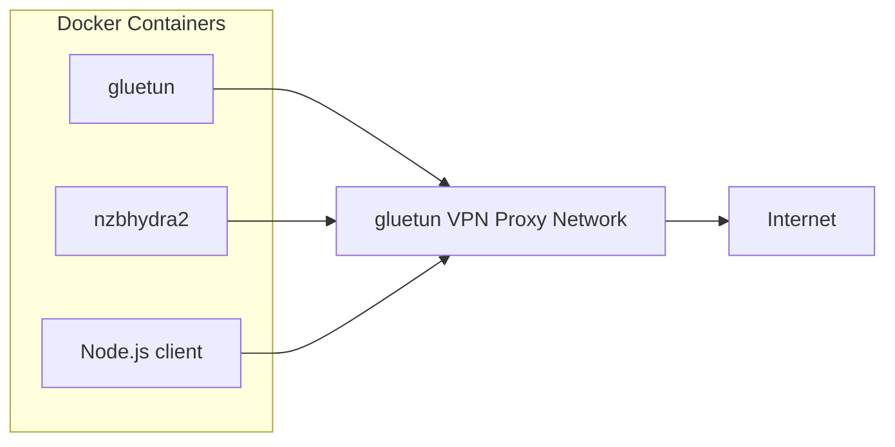
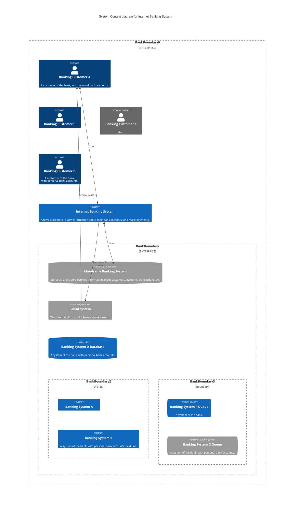

# Concept





# compose.yml file
```yaml
services:
  gluetun:
    image: qmcgaw/gluetun:latest
    container_name: gluetun
    cap_add:
      - NET_ADMIN
    devices:
      - /dev/net/tun:/dev/net/tun
    environment:
      VPN_SERVICE_PROVIDER: ${VPN_SERVICE_PROVIDER}
      VPN_TYPE: ${VPN_TYPE}
      WIREGUARD_PRIVATE_KEY: ${WIREGUARD_PRIVATE_KEY}
      WIREGUARD_ADDRESSES: ${WIREGUARD_ADDRESSES}
      SERVER_COUNTRIES: ${SERVER_COUNTRIES}
    volumes:
      - ./gluetun:/gluetun
    ports:
      - 8089:8080
      - 5076:5076
    restart: unless-stopped
    healthcheck:
      test: ["CMD-SHELL", "wget -qO- https://ipinfo.io/ip || exit 1"]
      interval: 30s
      timeout: 10s
      retries: 5
  nzbhydra2:
    image: lscr.io/linuxserver/nzbhydra2:latest
    container_name: nzbhydra2
    network_mode: "service:gluetun"
    depends_on:
      gluetun:
        condition: service_healthy
    environment:
      PUID: ${PUID}
      PGID: ${PGID}
      TZ: ${TZ}
    volumes:
      - ./nzbhydra:/config
      - ./downloads:/downloads
    restart: unless-stopped
    healthcheck:
      test: ["CMD-SHELL", "curl https://ipinfo.io/ip || exit 1"]
      interval: 30s
      timeout: 10s
      retries: 5
  sabnzbd:
    image: lscr.io/linuxserver/sabnzbd:latest
    container_name: sabnzbd
    user: "1000:1000"
    network_mode: "service:gluetun"
    depends_on:
      gluetun:
        condition: service_healthy
    environment:
      PUID: ${PUID}
      PGID: ${PGID}
      TZ: ${TZ}
    volumes:
      - ./sabnzbd:/config
      - /storage/storagefs/downloads/complete:/downloads
      - /storage/storagefs/downloads/incomplete:/incomplete-downloads
    restart: unless-stopped
    healthcheck:
      test: ["CMD-SHELL", "wget -qO- https://ipinfo.io/ip || exit 1"]
      interval: 30s
      timeout: 10s
      retries: 5
```

# .env file
```ini
PUID=1000
PGID=1000
TZ=Europe/Berlin

VPN_SERVICE_PROVIDER=yourprovider
VPN_TYPE=wireguard
WIREGUARD_PRIVATE_KEY=yourprivatekey
WIREGUARD_ADDRESSES=providersnetwork
SERVER_COUNTRIES=yourcountries
```

# Prompts
 test from host: 
 ```bash
 docker run --rm --network=container:gluetun alpine:3.20 sh -c "apk add wget && wget -qO- https://ipinfo.io"
```

test from guest:
```guest
wget -qO- https://ipinfo.io/ip
```
# Sources
- https://hub.docker.com/r/qmcgaw/gluetun
- https://docs.linuxserver.io/images/docker-sabnzbd/
- https://docs.linuxserver.io/images/docker-nzbhydra2/