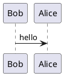

# Header
Your content here

```kroki
mermaid

graph TD
  A[ Anyone ] -->|Can help | B( Go to github.com/yuzutech/kroki )
  B --> C{ How to contribute? }
  C --> D[ Reporting bugs ]
  C --> E[ Sharing ideas ]
  C --> F[ Advocating ]
```

test

