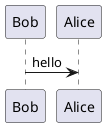

Willkommen in meinem digitalen Garten.

# Inhalt

Wiki.js is quick and easy to install. You should be up and running in no time.

- [Requirements *Server and database prerequisites.*](/install/requirements)
- [Installation Guide *Detailed installation instructions for all platforms.*](/install)
{.links-list}

```kroki
mermaid

graph TD
  A[ Anyone ] -->|Can help | B( Go to github.com/yuzutech/kroki )
  B --> C{ How to contribute? }
  C --> D[ Reporting bugs ]
  C --> E[ Sharing ideas ]
  C --> F[ Advocating ]
```





